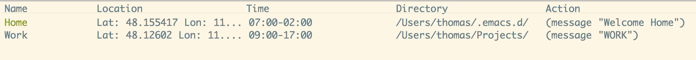

I have just finished my fist elisp package [elcontext](https://github.com/rollacaster/elcontext). It introduces context based actions for Emacs.

## Context based actions

A context-based action is an Emacs command called under certain conditions. These conditions can include the current time (similar to a [cron job](https://de.wikipedia.org/wiki/Cron)), the current folder and the current GPS location (available only for macOS).

## My use case

The original reason to create `elcontext` was to setup my development
environment depending on my current location. I start different applications
depending on my locations (workplace, home). I use
[prodigy](https://github.com/rejeep/prodigy.el) to define services I need and
`elcontext` starts them.

## Technical details

A new context is created interactively by using abo-abo's fantastic [hydra](https://github.com/abo-abo/hydra) package:

If a part of a context is omitted this part is always valid e.g. no location means anywhere, no time means anytime. Each command is triggered once a day.

I used Emacs' [Tabulated List mode](https://www.gnu.org/software/emacs/manual/html_node/elisp/Tabulated-List-Mode.html) to get an overview of all created contexts. Triggered contexts are highlighted in green:

All context data is stored in hash tables which can be created or accessed conveniently with [ht](https://github.com/Wilfred/ht.el) and the GPS coordinates are retrieved via [osx-location](https://github.com/purcell/osx-location).

## Conclusion

I am proud I finished my fist Emacs package and would be happy if it's useful to
someone else. If you consider `elcontext` helpful, I would be pleased to [hear
about your use cases](https://github.com/rollacaster/elcontext/issues).
